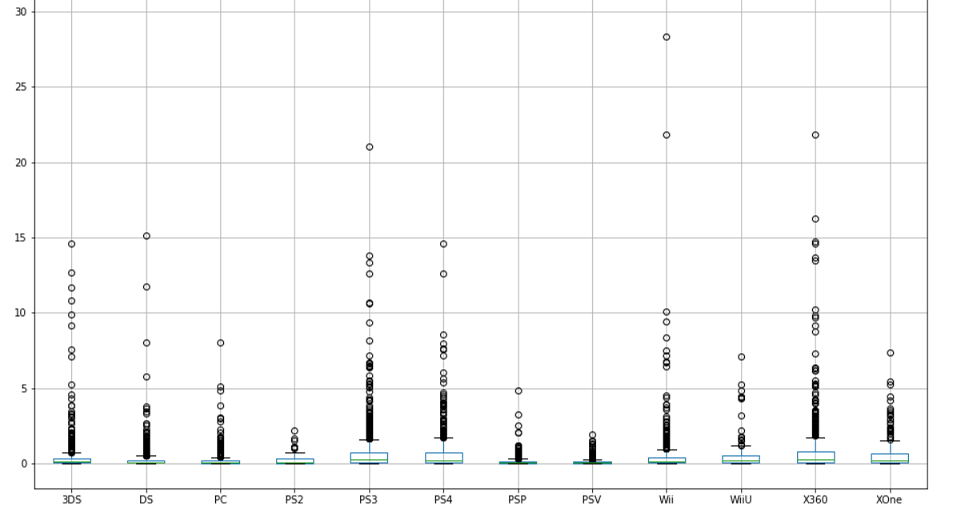
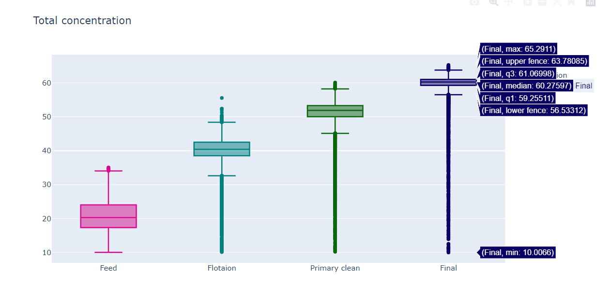

## Gennadiy Gormulinskiy portfolio

### About

My name is Gennadiy and I am a Junior Data Scientist with **10+ years of experience in developing and implementing ERP** systems in commercial and financial companies. Recent **Practicum by Yandex School of Data** graduate with 13 completed DS projects. Able to manage large databases and optimize performance as well as understand business goals, and extract benefits from companies' data. Additional accomplishments - the course **Mathematics for Data Science** from Otus Education.  Currently, I keep improving my Python programming skill on course **Python backend developer** by Yandex Practicum.

### [LinkedIn](https://www.linkedin.com/in/%D0%B3%D0%B5%D0%BD%D0%BD%D0%B0%D0%B4%D0%B8%D0%B9-%D0%B3%D0%BE%D1%80%D0%BC%D1%83%D0%BB%D0%B8%D0%BD%D1%81%D0%BA%D0%B8%D0%B9-374a47a0/)

### Projects Overview
##### Projects completed during "Yandex.Practicum Data Scientist" professional program

[Jupyter notebook](#jn)
- [Gaming platform analysis](#game)
- [Bank clients outlow](#bank)
- [Gold mining](#gold)

# Jupyter notebook

## [Gaming platform analysis](https://github.com/GEGorm/Gennadiy_Gormulinskiy_Porfolio/blob/1db1f8b34423b3d20642f0ef69dfdeb562aafb8d/Games%20analysis/Games_Analysis.ipynb)

 
## Project's goal

We work for the online store Ice, which **sells video games** all over the world. 
We need to **identify patterns** that determine whether a **game succeeds or not**. This will allow to **spot potential big winners** and **plan advertising campaigns**.
 
 In this project I've analyzed released games:
 * Determined how many games are there per each year, chose a suitable date interval for analysis
 * Analyzed gaming platforms, choose most popular through years, found game platform life cycle
 * Selected the most promising platform
 * Determined the impact of the review on game sales
 * Analysed data per region of sale, and game genre
 * Tested the following hypotheses:
    - Average user ratings of the Xbox One and PC platforms are the same
    - Average user ratings for the Action and Sports genres are different. 
 
**Key words**: games, hypotheses testing  

**Libraries used**: pandas, numpy, seaborn, scipy, matplotlib

## [Bank clients outlow](https://github.com/GEGorm/Gennadiy_Gormulinskiy_Porfolio/blob/aa7f0054a4ef5ed97df02d591ac5f9a213ba9e4a/Bank%20clients%20outlow/Bank%20clients%20outflow.ipynb)
 
## Project's goal

We work at Beta bank, which suffers from client outflow
We need to **predict** whether a **customer will leave the bank soon**. We have the data on **clients’ past behavior** and **termination of contracts** with the bank.  
Our task is to **build a model** with the **maximum possible F1 score**. Acceptable **F1 score** of at least **0.59** on the test set.

In this project I've built a model to predict client churn:
 * Data was preprocessed
 * Used ordinal encoder for tree algorithms
 * Tested different approaches for eliminating class imbalances
 * Trained ML models such as - DecisionTreeClassifier, RandomForestClassifier, LogisticRegression
 * Managed to get required f1-score, which allows predicting clients behavior
 *  
**Key words**: MachineLearning, SupervisedLearning, model, LogisticRegression, RandomForestClassifier, f1_score, OrdinalEncoder 

**Libraries used**: pandas, sklearn

## [Gold mining](https://github.com/GEGorm/Gennadiy_Gormulinskiy_Porfolio/blob/aa7f0054a4ef5ed97df02d591ac5f9a213ba9e4a/Gold%20mining/Gold%20mining.ipynb)
 

## Project's goal

Our goal is to prepare **prototype of a machine learning model** for the gold mining company. This company develops efficient solutions for heavy industry.
The model should **predict the amount of gold recovered from gold ore**. We have the data on extraction and purification. The model will help to optimize the production and eliminate unprofitable parameters.
The metric for the task - sMape.
It is similar to MAE, but is expressed in relative values instead of absolute ones. It equally takes into account the scale of both the target and the prediction.

In this project I've built a model to predict the amount of gold recovered from gold ore:
 * Data was preprocessed
 * Explored the process and stages of gold extraction from the gold genus
 * Analyzed concentration of metals in gold ore
 * Developed function for new metric - sMape
 * For tuning hyperparameters was used GridSearch 
 * Trained ML models such as - LinearRegression, RandomForestRegressor, DecisionTreeRegressor
 * Managed to get better sMape score than baseline models based on a median target
 
### Certificates

